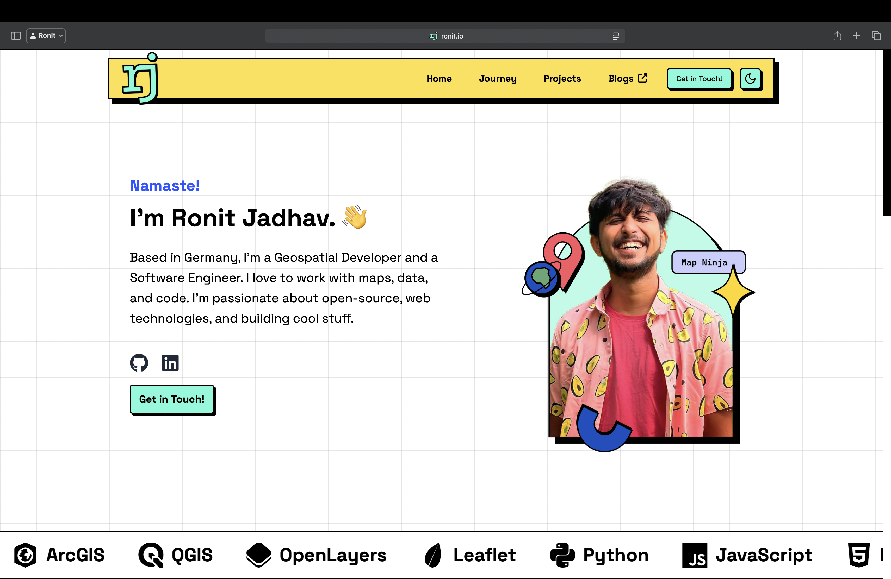
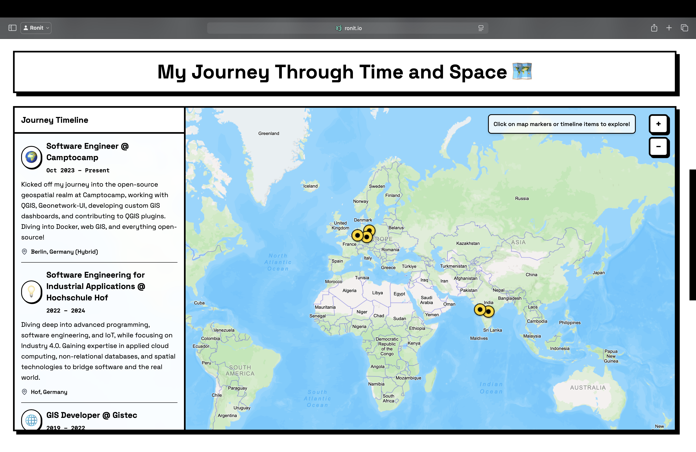
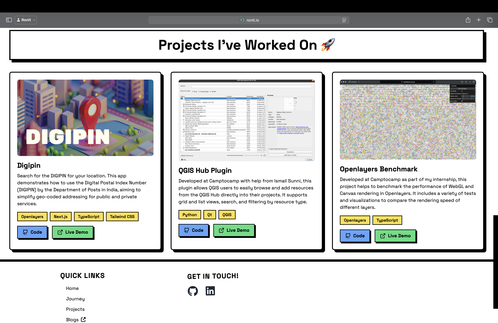

# ronit.io

  

Welcome to my personal website!

## Table of Contents

- [About](#about)
- [Screenshots](#screenshots)
- [Getting Started](#getting-started)
- [Features](#features)
- [Technologies Used](#technologies-used)
- [Deployment](#deployment)
- [Contributing](#contributing)
- [Contact](#contact)

## About

**ronit.io** is my personal website where I share my projects, blog posts, and more. It's built using [Next.js](https://nextjs.org) and styled with [Tailwind CSS](https://tailwindcss.com). The site is designed to be fast, accessible, and easy to maintain.

## Screenshots

<!-- If you have screenshots, add them here -->
<!--  -->







## Getting Started

To run the website locally, follow these steps:

1. **Clone the repository:**

```bash
git clone https://github.com/ronitjadhav/ronit.io.git
cd ronit.io
```

2. **Install dependencies:**

```bash
npm install
# or
yarn install
# or
pnpm install
```

3. **Run the development server:**

```bash
npm run dev
# or
yarn dev
# or
pnpm dev
```

4. **Open** [http://localhost:3000](http://localhost:3000) **in your browser to see the website.**

## Features

- **Projects:** Showcase of my projects with descriptions and links.
- **Blog:** Articles and tutorials on various topics.
- **Contact:** A form to get in touch with me.
- **Responsive Design:** Looks great on all devices.
- **SEO Optimized:** Built-in SEO best practices.
- **Fast & Accessible:** Optimized for performance and accessibility.

## Technologies Used

- **Next.js:** A React framework for building fast and user-friendly web applications.
- **Tailwind CSS:** A utility-first CSS framework for rapid UI development.
- **TypeScript:** A strongly typed programming language that builds on JavaScript.

## Deployment

This site can be easily deployed to platforms like [Vercel](https://vercel.com/) or [Netlify](https://www.netlify.com/).

To build for production:

```bash
npm run build
npm start
```

## Contributing

Contributions are welcome! If you have suggestions, bug reports, or want to add features, please open an issue or submit a pull request.

1. Fork the repository
2. Create your feature branch (`git checkout -b feature/YourFeature`)
3. Commit your changes (`git commit -m 'Add some feature'`)
4. Push to the branch (`git push origin feature/YourFeature`)
5. Open a pull request

## Contact

You can reach me at [hi@ronit.io](mailto:hi@ronit.io)

Thank you for visiting my website!
