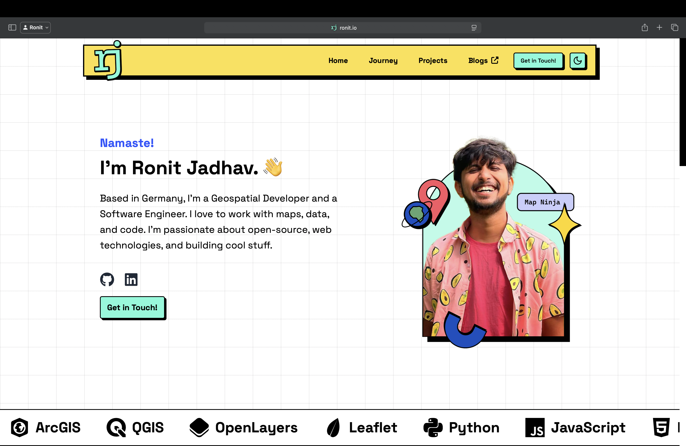
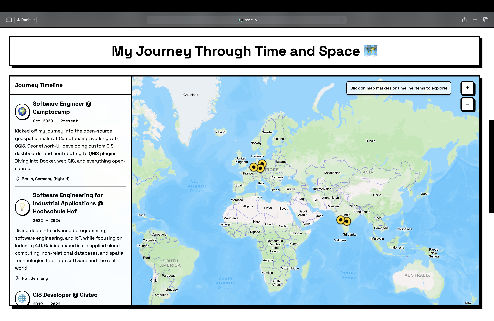
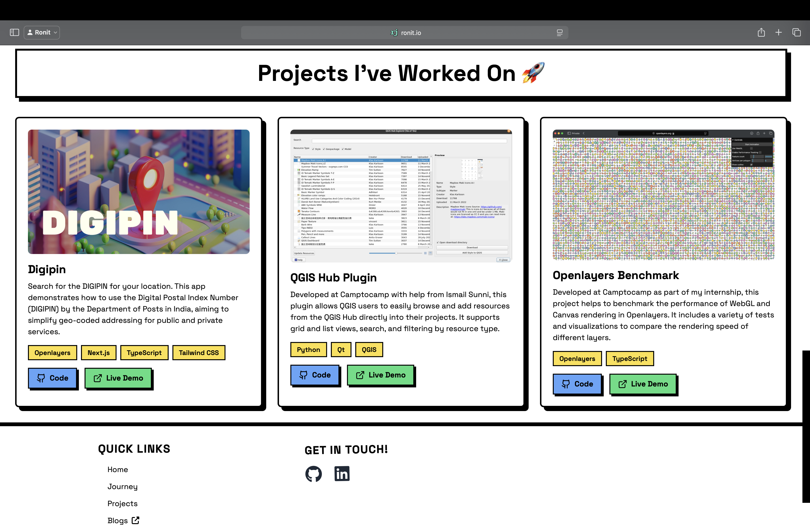

# ronit.io

  

Welcome to my personal website!

## Table of Contents

- [About](#about)
- [Screenshots](#screenshots)
- [Getting Started](#getting-started)
- [Environment Variables](#environment-variables)
- [Customization](#customization)
- [Features](#features)
- [Technologies Used](#technologies-used)
- [Deployment](#deployment)
- [Contributing](#contributing)
- [Contact](#contact)

## About

**ronit.io** is my personal website where I share my projects, blog posts, and more. It's built using [Next.js](https://nextjs.org) and styled with [Tailwind CSS](https://tailwindcss.com). The site is designed to be fast, accessible, and easy to maintain.

## Screenshots

<!-- If you have screenshots, add them here -->
<!--  -->







## Getting Started

To run the website locally, follow these steps:

1. **Clone the repository:**

```bash
git clone https://github.com/ronitjadhav/ronit.io.git
cd ronit.io
```

2. **Install dependencies:**

```bash
npm install
# or
yarn install
# or
pnpm install
```

3. **Set up environment variables:**

Copy the example environment file and add your API keys:

```bash
cp .env.example .env
```

Then edit `.env` with your actual values. See [Environment Variables](#environment-variables) section below for details.

4. **Run the development server:**

```bash
npm run dev
# or
yarn dev
# or
pnpm dev
```

5. **Open** [http://localhost:3000](http://localhost:3000) **in your browser to see the website.**

## Environment Variables

This project requires several environment variables to function properly. Copy `.env.example` to `.env` and fill in your values:

```bash
cp .env.example .env
```

### Google reCAPTCHA v2 (Contact Form)

| Variable                                | Description                                        |
| --------------------------------------- | -------------------------------------------------- |
| `NEXT_PUBLIC_GOOGLE_RECAPTCHA_SITE_KEY` | reCAPTCHA v2 site key ("I'm not a robot" checkbox) |

- Get your keys at: [Google reCAPTCHA Admin](https://www.google.com/recaptcha/admin/create)
- Choose **reCAPTCHA v2** → "I'm not a robot" Checkbox
- Add `localhost` to your allowed domains for local development

### EmailJS (Contact Form)

| Variable                          | Description                                              |
| --------------------------------- | -------------------------------------------------------- |
| `NEXT_PUBLIC_EMAILJS_SERVICE_ID`  | Your EmailJS service ID (e.g. `service_xxxxxxx`)         |
| `NEXT_PUBLIC_EMAILJS_TEMPLATE_ID` | Your EmailJS email template ID (e.g. `template_xxxxxxx`) |
| `NEXT_PUBLIC_EMAILJS_PUBLIC_KEY`  | Your EmailJS account public key                          |

- Sign up at: [EmailJS](https://www.emailjs.com/)
- **Service ID**: Create an email service (Gmail, Outlook, etc.) → copy the Service ID
- **Template ID**: Create an email template with variables `{{from_name}}`, `{{email}}`, `{{message}}` → copy the Template ID
- **Public Key**: Go to Account → General → copy your Public Key

### Mapbox (Interactive Map)

| Variable                             | Description                                                                |
| ------------------------------------ | -------------------------------------------------------------------------- |
| `NEXT_PUBLIC_MAPBOX_ACCESS_TOKEN`    | Mapbox access token for map rendering                                      |
| `NEXT_PUBLIC_MAPBOX_LIGHT_STYLE_URL` | Mapbox style URL for light theme (e.g. `mapbox://styles/mapbox/light-v11`) |
| `NEXT_PUBLIC_MAPBOX_DARK_STYLE_URL`  | Mapbox style URL for dark theme (e.g. `mapbox://styles/mapbox/dark-v11`)   |

- Get your access token at: [Mapbox Access Tokens](https://account.mapbox.com/access-tokens/)
- Create custom map styles at: [Mapbox Studio](https://studio.mapbox.com/) or use Mapbox defaults

### Optional (Development)

| Variable  | Description                                                              |
| --------- | ------------------------------------------------------------------------ |
| `ANALYZE` | Set to `true` to enable webpack bundle analysis during production builds |

### Setup Instructions:

1. Copy the example file: `cp .env.example .env`
2. Fill in your API keys and tokens
3. Restart the development server (`npm run dev`)

### Troubleshooting:

- **Contact form failing**: Verify `NEXT_PUBLIC_GOOGLE_RECAPTCHA_SITE_KEY` and EmailJS credentials
- **Maps not loading**: Ensure `NEXT_PUBLIC_MAPBOX_ACCESS_TOKEN` is valid
- **reCAPTCHA issues**: Confirm domain is registered in Google reCAPTCHA admin

## Customization

This project is designed to be easily **forked and customized** as your own portfolio. All personal data (name, bio, projects, skills, timeline, SEO, etc.) is centralized in a single configuration file:

```
src/data/site-config.ts
```

To make this portfolio your own:

1. Fork this repository
2. Edit `src/data/site-config.ts` with your personal data
3. Replace images in `src/media/` with your own
4. Update `.env` with your API keys
5. Deploy!

For a detailed step-by-step guide, see **[CUSTOMIZATION.md](./CUSTOMIZATION.md)**.

## Features

- **📧 Contact Form:** Secure contact form with reCAPTCHA verification and EmailJS integration
- **🗺️ Interactive Maps:** Custom Mapbox integration with light/dark theme support
- **📱 Responsive Design:** Optimized for desktop, tablet, and mobile devices
- **🎨 Neobrutalism Theme:** Clean, minimal design with bold shadows and borders
- **🌙 Dark Mode:** Full dark/light theme support with system preference detection
- **⚡ Performance:** Built with Next.js 15 and optimized for speed
- **♿ Accessibility:** WCAG compliant with proper ARIA labels and keyboard navigation
- **🔍 SEO Optimized:** Built-in SEO best practices with meta tags and sitemaps
- **📊 Projects Showcase:** Detailed project portfolio with descriptions and live links

## Technologies Used

- **Next.js 15:** React framework with App Router and Turbopack for fast development
- **TypeScript:** Strongly typed JavaScript for better development experience
- **Tailwind CSS:** Utility-first CSS framework for rapid UI development
- **Mapbox:** Interactive maps with custom styling
- **EmailJS:** Client-side email sending for contact forms
- **Google reCAPTCHA:** Bot protection and spam prevention
- **Lucide React:** Beautiful, customizable icon library
- **Next Themes:** Dark/light theme management
- **React Google reCAPTCHA:** reCAPTCHA integration for React

## Deployment

This site can be easily deployed to platforms like [Vercel](https://vercel.com/) or [Netlify](https://www.netlify.com/).

### Environment Variables for Production:

When deploying, make sure to add all environment variables from `.env.example` to your deployment platform:

- Vercel: Project Settings → Environment Variables
- Netlify: Site Settings → Environment Variables

### Build Commands:

```bash
npm run build
npm start
```

### Important Notes:

- All `NEXT_PUBLIC_*` variables are exposed to the client-side
- Keep any server-side variables you add secure and never expose them
- Test all features (contact form, maps) after deployment
- Ensure your domain is registered with Google reCAPTCHA for production

## Contributing

Contributions are welcome! If you have suggestions, bug reports, or want to add features, please open an issue or submit a pull request.

1. Fork the repository
2. Create your feature branch (`git checkout -b feature/YourFeature`)
3. Commit your changes (`git commit -m 'Add some feature'`)
4. Push to the branch (`git push origin feature/YourFeature`)
5. Open a pull request

## Contact

You can reach me through the **Get in Touch** button by visiting [ronit.io](https://ronit.io).

Thank you for visiting my website!
